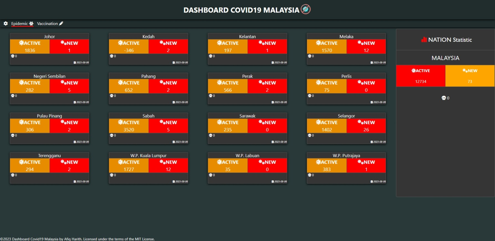

# DASHBOARD COVID19 MALAYSIA

[](https://github.com/MoH-Malaysia/covid19-public)
[](https://github.com/CITF-Malaysia/citf-public)
[](https://github.com/afiqharith/api-covid-malaysia)

<div align="center" style="border:solid; border-size: 0.4vmin; border-color:black">
  
</div>

### 1. To run locally in Python3 environment

Run:

```sh
$ pip3 install -r requirements.txt
$ python3 wsgi.py
```

### 2. To run locally in Docker

Run:

```sh
$ docker build -t dashboardcovidmy .
$ docker run -p 5000:5000 -d dashboardcovidmy .
```

### 3. Deployment

[](https://dashboard-covidmy.onrender.com)
